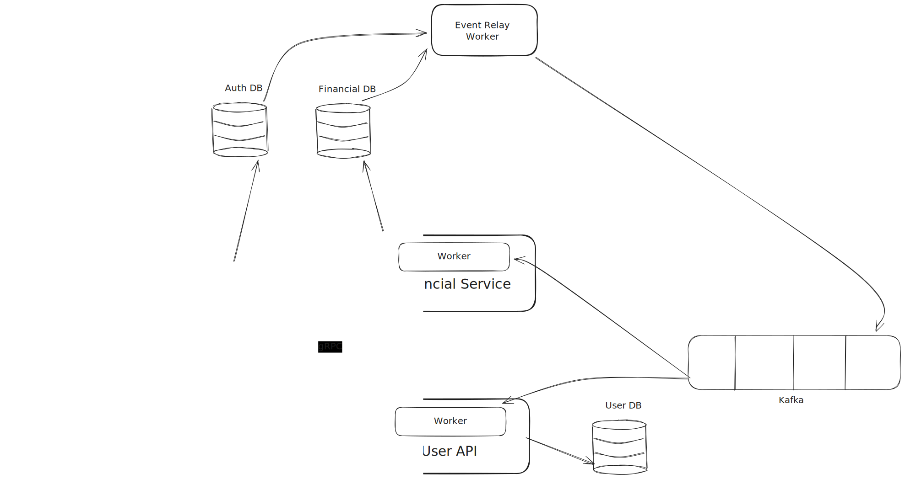

# License

Shield: [![CC BY-NC 4.0][cc-by-nc-shield]][cc-by-nc]

This work is licensed under a
[Creative Commons Attribution-NonCommercial 4.0 International License][cc-by-nc].

This project uses third-party libraries under their own respective licenses.
No modification of third-party licenses is intended.

[![CC BY-NC 4.0][cc-by-nc-image]][cc-by-nc]

[cc-by-nc]: https://creativecommons.org/licenses/by-nc/4.0/
[cc-by-nc-image]: https://licensebuttons.net/l/by-nc/4.0/88x31.png
[cc-by-nc-shield]: https://img.shields.io/badge/License-CC%20BY--NC%204.0-lightgrey.svg

# Ledger

## Architecture



# Ledger Gateway – Architecture Overview


## High-Level Architecture

The Ledger system follows a **gateway-centric architecture**, where the **Ledger Gateway** acts as the single entry point for the front-end and orchestrates communication with internal backend services.

The system is composed of:

* A front-end client (Angular + NGINX)
* A backend gateway (Ledger Gateway)
* Multiple backend services (SimpleAuth, Financial Service, User API)
* Asynchronous messaging infrastructure (Outbox Pattern + Kafka)
* Workers responsible for message relay and processing

All backend services are implemented in **C# using .NET and ASP.NET Core**.

---

## Front-End Client

The front-end client is built using **Angular** and is deployed behind **NGINX**, which plays two roles:

1. **Static Content Server**
   NGINX serves HTML, JavaScript, CSS, and other front-end assets.

2. **Reverse Proxy**
   NGINX proxies HTTP requests from the browser to the **Ledger Gateway**.

The front-end communicates **exclusively via HTTP REST** with the Ledger Gateway. It never accesses backend services directly.

---

## Ledger Gateway

The **Ledger Gateway** is the central coordination layer between the front-end and backend services.

### Responsibilities

* Acts as the **single entry point** for the front-end
* Handles **authentication and authorization**
* Validates JWT tokens issued by SimpleAuth
* Forwards requests to backend services
* Authenticates itself to backend services using **API Keys**

### Communication Protocols

The Ledger Gateway communicates with backend services using multiple protocols, depending on the use case:

| Target Service    | Protocol |
| ----------------- | -------- |
| SimpleAuth        | REST     |
| Financial Service | gRPC     |
| User API          | REST     |

### Front-End Authentication

Authentication between the front-end and the Ledger Gateway is handled via **JWT tokens**, which can be transmitted in two ways:

* **HTTP Cookies**
* **Authorization headers (Digest / Bearer tokens)**

When a user registers or logs in:

1. The front-end sends a request to the Ledger Gateway.
2. The Ledger Gateway forwards the request to **SimpleAuth**.
3. SimpleAuth issues a JWT containing the required claims.
4. The Ledger Gateway returns the token to the front-end (typically via cookies).

The Ledger Gateway also validates JWTs locally, ensuring:

* The token was issued by **SimpleAuth**
* The token is valid and not expired
* The request is authorized before being forwarded

### Service-to-Service Authentication

Internal service communication is authenticated using **API Keys**.

Each backend service has:

* Its own API key
* Validation logic for incoming requests

The Ledger Gateway authenticates itself to each backend service using the corresponding API key.

---

## SimpleAuth Service

The **SimpleAuth** service is responsible **only for authentication concerns**.

### Responsibilities

* User authentication
* JWT token issuance
* Secure storage of authentication data

### Technical Details

* Uses **PostgreSQL** as its database
* Uses **Entity Framework (Code-First)** for schema management
* Database schema is initialized via **migrations**
* Stores authentication-related data only (no user profile or financial data)

### Outbox Integration

When a user is registered:

* The event is recorded in an **OutboxMessages** table
* This event is later picked up by the **EventRelayWorker**
* The event is published to Kafka so other services can react asynchronously

---

## Financial Service

The **Financial Service** is responsible for **all financial operations** in the system.

### Responsibilities

* Money transfers between accounts
* Deposits (using a system “cash-in” account)
* Balance management
* Financial consistency

### Communication

* Exposes a **gRPC API**, chosen to efficiently handle high-throughput and low-latency requests

### Data and Workers

* Has its **own PostgreSQL database**
* Maintains financial data such as balances and transactions
* Includes a **Worker** responsible for consuming Kafka messages

### User Registration Flow

When a `UserRegistered` event is received:

1. The Financial Service creates a **financial account/balance** for the user.
2. A new event (`AccountBalanceCreated`) is written to its Outbox table.
3. This event is later relayed to Kafka by the EventRelayWorker.
4. Other services (such as User API) can consume and react to this event.

---

## User API

The **User API** manages **general user profile data**, not authentication data.

### Responsibilities

* Store and manage user profile and domain data
* Maintain the user lifecycle state
* Decide whether a user is considered **active**

### Database and Worker

* Has its **own PostgreSQL database**
* Contains a **Worker** that consumes Kafka events

### User Activation Logic

A user is only considered **active** when **both** of the following are true:

* The user exists in the **User API** domain
* A corresponding financial account exists in the **Financial Service**

To handle this:

* The User API maintains a **state table** tracking whether:

  * The user profile has been created
  * The financial account has been created
* The Worker updates this table as Kafka events are processed
* Once both conditions are satisfied, the user is marked as **active**

Inactive users cannot access the application

---

## Messaging and Event Infrastructure

### Outbox Pattern

Each service maintains its own **OutboxMessages** table.

* Business operations and outbox writes occur in the **same database transaction**
* Guarantees consistency between state changes and emitted events

### EventRelayWorker

The **EventRelayWorker** is a shared infrastructure component responsible for:

* Reading OutboxMessages from service databases
* Publishing events to **Kafka**
* Handling retries and transient failures

Duplicate message publication is possible, but safe.

### Idempotency

All consumers are designed to be **idempotent**:

* Each service maintains idempotency tables
* Duplicate Kafka messages do not cause duplicated side effects

---

## Kafka

Kafka is used as the system’s **event backbone**.

### Characteristics

* Supports multiple independent consumers
* Enables event-driven integration between services
* Horizontally scalable
* Well-suited for high-volume, distributed systems

Kafka decouples services and allows the system to evolve without tight runtime dependencies.

# How to run

## Run with Docker

### Prerequisites 

#### Required
- **Docker** version 20.10 or higher
- **Docker Compose** version 2.0 or higher (included in Docker Desktop)

#### Optional
- **[Signoz](https://github.com/SigNoz/signoz/tree/main/deploy)** for observability and telemetry collection

### Running the Application

#### Basic Setup (All Services)

1. From the project root directory, run:
```bash
docker compose up
```

This will start all core services:
- PostgreSQL database (port 5432)
- Simple Auth API (port 5001)
- User API (port 5002)
- Financial Service (port 5003)
- Event Relay Worker (port 5005)
- Apache Kafka broker (port 29092)
- Kafka UI (port 8081)
- Front-end application (port 5006)
- Ledger Gateway (port 5000)

### Optional: Observability Setup with Signoz

To enable distributed tracing and metrics collection:

1. Create a shared Docker network:
```bash
docker network create signoz-ledger-net
```

2. Configure Signoz to use the shared network:
   - Navigate to your Signoz installation: `signoz/deploy/docker/docker-compose.yaml`
   - Add the network configuration:
```yaml
networks:
  signoz-ledger-net:
    external: true
```
   - Add `signoz-ledger-net` to the **x-common** networks section

3. Start Signoz according to its documentation

4. Start the Ledger services (they are already configured to connect to `http://signoz-otel-collector:4317`)

5. Access the Signoz UI at `http://localhost:8080` to view traces, metrics, and logs

## Run with Kubernets (k8s) locally

### Prerequisites 

#### Required
- **Docker Desktop** (includes Docker, Docker Compose and Kubernetes)
- **Bash interpreter**
- **Helm** version 4.0.4 >=

#### Optional
- **[Signoz with Helm](https://signoz.io/docs/install/kubernetes/local/)** for observability and telemetry collection. Follow instructions or see steps bellow

#### Images

1. Build images with either `docker build -f <Dockerfile>` on all services or build them with `docker compose up --build`
2. Also, since this project allow you to also deploy to AWS, it may be necessary to adjust k8s/infra.yaml files on each service to pull images locally. 

### Running the Application

#### Basic Setup (All Services)

1. From the project root directory, run:
```bash
./k8s/startup.sh
```
This script applies all Kubernetes manifests (databases, brokers, services and apps) in the correct order.

This will start all core services:
- PostgreSQL database
- Simple Auth API
- User API
- Financial Service
- Event Relay Worker
- Apache Kafka broker
- Kafka UI
- Front-end application
- Ledger Gateway


#### Tear down basic setup

1. From the project root directory, run:
```bash
./k8s/teardown.sh
```

### Optional: Observability Setup with Signoz

To enable distributed tracing and metrics collection:

1. Run the following instructions from your terminal
```
helm repo add signoz https://charts.signoz.io
helm repo update
helm pull signoz/signoz --untar
cd signoz
helm install signoz .
```

3. Run `kubectl port-forward -n <namespace> svc/signoz 8080:8080`. If not specified in signoz installation, the \<namespace\> will be **default**

4. Start the Ledger services (they are already configured to connect to `http://signoz-otel-collector:4317`)

5. Access the Signoz UI at `http://localhost:8080` to view traces, metrics, and logs